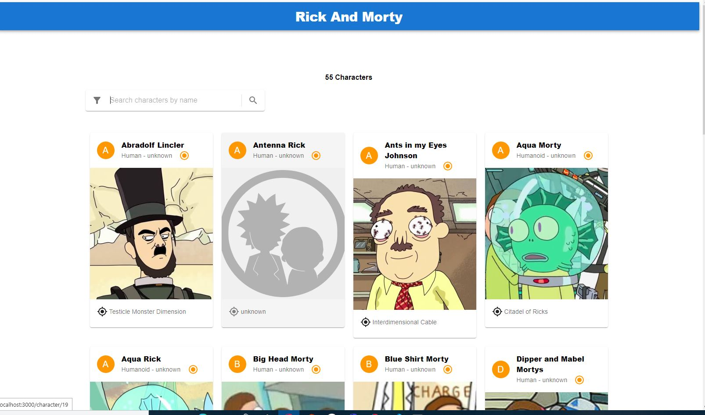

# Rick and Morty App




## Descripción
El backend usa Typescript haciendo uso de una arquitectura onion. Hace uso del endpoint GRAPHQL de Rick and Morty https://rickandmortyapi.com. Usando ello, he creado 3 endpoints para consumirlo en el frontend. 1 para obtener todos los personajes humanos, otro para filtrar todos los personajes humanos por nombre y estado y el otro para obtener la información individual de cada personaje
El frontend usa Javascript Material UI y nextjs. Usé axios para consumir los endpoints creados y mostrar todos los personajes, asi como filtrado y ruta dinámica por cada personaje

## Características

Muestra la información de todos los personajes humanos de Rick and Morty
Presenta paginación 
Presenta un searchbar para buscar solo personajes humanos por nombre
Presenta un filtro para buscar  personajes humanos en estado vivo, muerto o desconocido
Muestra la cantidad de resultados


## Instalación 

Provide instructions on how to install your app. Include any dependencies or prerequisites that users need to have installed.

```bash
# Clone the repository
git clone https://github.com/GodoyMS/rick_and_morty.git

# Navigate to the server directory
cd server
# Install dependencies
yarn install

# Run the project 
yarn run dev


# Navigate to the server directory
cd client
# Install dependencies
npm install

# Run the project 
npm run dev


